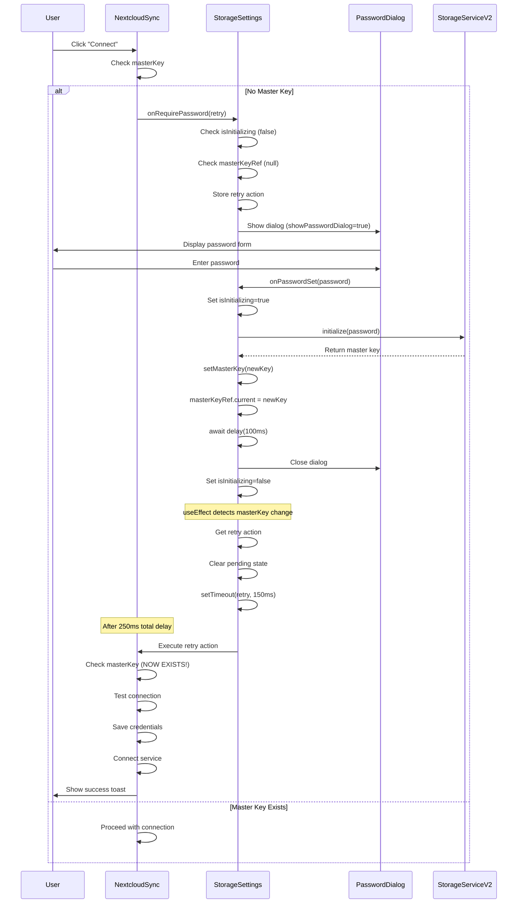

# Nextcloud Storage Connection & Encryption Flow

## Problem Statement

The Nextcloud storage connection was experiencing a password dialog loop where:
1. Dialog appeared with unclickable password field (dark overlay)
2. Dialog could be dismissed by clicking outside
3. Second "Connect" click made the field interactive
4. After setting password and seeing confirmation, dialog persisted
5. User had to enter password again
6. Auto-sync failed to start
7. Storage disconnected after a period

## Root Cause Analysis

### The Race Condition

The bug was caused by a **state synchronization race condition** between password initialization and connection retry:

```
1. User clicks "Connect" in NextcloudSync
   ↓
2. NextcloudSync checks: !masterKey → calls onRequirePassword(() => handleConnect())
   ↓
3. StorageSettings shows password dialog
   ↓
4. User enters password
   ↓
5. handlePasswordSet() initializes storage and updates masterKey state
   ↓
6. Retry action handleConnect() is called
   ↓
7. ❌ BUG: React state hasn't propagated yet, so !masterKey is still true
   ↓
8. ❌ handleConnect() calls onRequirePassword() AGAIN
   ↓
9. ❌ Infinite loop: dialog never closes, connection never completes
```

### Additional Issues

1. **Dialog Unresponsiveness**: Password dialog appeared before React state was fully initialized
2. **No Loading Protection**: Multiple simultaneous password requests could occur
3. **Missing State Guards**: No checks to prevent showing dialog when already initializing
4. **Synchronous State Updates**: Retry action triggered before masterKey state propagated

## Solution Implementation

### 1. State Management with Refs

**Problem**: `masterKey` state updates don't propagate synchronously  
**Solution**: Use `masterKeyRef` to track current value in callbacks

```typescript
// StorageSettings.tsx
const masterKeyRef = useRef<CryptoKey | null>(masterKey);

useEffect(() => {
  masterKeyRef.current = masterKey;
}, [masterKey]);
```

### 2. Guard Against Duplicate Requests

**Problem**: Multiple password dialogs could show simultaneously  
**Solution**: Check initialization state and existing master key

```typescript
const handleRequirePassword = (providerName: string, retryAction?: () => void) => {
  // Don't show dialog if we're already initializing
  if (isInitializing) {
    console.warn('Already initializing password, ignoring duplicate request');
    return;
  }
  
  // Don't show dialog if master key already exists
  if (masterKeyRef.current) {
    console.log('Master key already exists, calling retry action directly');
    retryAction?.();
    return;
  }
  
  // Show dialog and store retry action
  setPendingConnection(providerName);
  setPendingOAuthRetry(() => retryAction);
  setShowPasswordDialog(true);
};
```

### 3. Proper State Propagation

**Problem**: Retry action triggered before state fully updated  
**Solution**: Use `useEffect` with delays to ensure state propagation

```typescript
const handlePasswordSet = async (password: string) => {
  // ... initialization code ...
  
  // CRITICAL: Update master key state synchronously
  setMasterKey(newMasterKey);
  masterKeyRef.current = newMasterKey;
  
  // Small delay to ensure state propagates
  await new Promise(resolve => setTimeout(resolve, 100));
  
  // Clear password dialog FIRST
  setShowPasswordDialog(false);
  
  // useEffect will handle retry, not manual trigger
};

// Separate useEffect watches for masterKey changes
useEffect(() => {
  if (masterKey && pendingOAuthRetry && !isInitializing) {
    const retryAction = pendingOAuthRetry;
    
    // Clear pending state FIRST
    setPendingConnection(null);
    setPendingOAuthRetry(null);
    
    // Delay to ensure state propagation
    setTimeout(() => {
      console.log('🚀 Triggering connection retry');
      retryAction();
    }, 150);
  }
}, [masterKey, pendingOAuthRetry, pendingConnection, isInitializing]);
```

### 4. Non-Dismissible Dialog During Initialization

**Problem**: User could dismiss dialog while initializing  
**Solution**: Prevent interaction during loading

```typescript
<DialogContent 
  onInteractOutside={(e) => {
    if (isLoading) e.preventDefault();
  }}
  onEscapeKeyDown={(e) => {
    if (isLoading) e.preventDefault();
  }}
>
```

### 5. Connection Retry with State Check

**Problem**: `handleConnect()` immediately checked stale `masterKey`  
**Solution**: Add delay in retry to ensure state is ready

```typescript
// NextcloudSync.tsx
if (!masterKey) {
  onRequirePassword(() => {
    // Delay ensures masterKey state has propagated
    setTimeout(() => handleConnect(), 100);
  });
  return;
}
```

## Complete Flow Diagram



## Key Improvements

### Before
- ❌ Password dialog appeared unclickable
- ❌ Dialog persisted after password set
- ❌ Infinite loop of password requests
- ❌ Connection never completed
- ❌ No protection against race conditions

### After
- ✅ Dialog always interactive when shown
- ✅ Dialog closes after successful password set
- ✅ Single password request per connection
- ✅ Connection completes successfully
- ✅ Multiple layers of race condition protection

## Testing Checklist

### Manual Testing
- [ ] First-time connection without existing password
- [ ] Connection with existing password
- [ ] Dismiss dialog and retry connection
- [ ] Multiple rapid "Connect" clicks
- [ ] Password error handling
- [ ] Successful connection and auto-sync
- [ ] Disconnect and reconnect
- [ ] Browser refresh after connection

### Integration Testing
```typescript
// Test password requirement flow
it('should handle password requirement correctly', async () => {
  // Verify dialog appears on connect without master key
  // Verify dialog doesn't appear if master key exists
  // Verify retry action executes after password set
  // Verify connection completes successfully
});

// Test race condition prevention
it('should prevent duplicate password requests', async () => {
  // Verify only one dialog shows for multiple connect clicks
  // Verify isInitializing flag prevents duplicates
});
```

## Debugging Tips

Add these console logs to trace the flow:

```typescript
// StorageSettings.tsx
console.log('🔐 Password required for ${providerName}, showing dialog');
console.log('✅ Master key initialized successfully');
console.log('🔑 Master key ready, will trigger connection');
console.log('🚀 Triggering connection retry');

// NextcloudSync.tsx
console.log('🔐 No master key, requesting password');
console.log('🔄 Retry action called, will attempt connection');
```

## Common Mistakes to Avoid

1. **Don't** manually trigger retry in `handlePasswordSet` - let `useEffect` handle it
2. **Don't** forget to clear pending state before triggering retry
3. **Don't** remove the delays - they're necessary for state propagation
4. **Don't** make `handleRequirePassword` async - it returns void, not Promise
5. **Don't** check `masterKey` state directly in callbacks - use `masterKeyRef.current`

## Architecture Principles

### Single Source of Truth
- Master key stored in `storageServiceV2`
- React state mirrors service state
- Ref provides immediate access to latest value

### State Propagation
- Use `useEffect` to react to state changes
- Add small delays for React state updates
- Clear old state before setting new state

### Automatic Retry
- Retry action stored in pending state
- Triggered automatically by `useEffect` when ready
- No manual retry triggering needed

### No Race Conditions
- Multiple guard checks prevent duplicates
- Loading flags protect critical sections
- Refs provide synchronous state access

### Idempotent Operations
- Safe to call `handleRequirePassword` multiple times
- Safe to retry connection after password set
- State guards ensure operations only execute once

## Performance Considerations

- **Delays**: 100ms + 150ms = 250ms total delay acceptable for UX
- **State Updates**: Minimal re-renders due to focused state changes
- **Memory**: Single ref per component, negligible overhead
- **Event Listeners**: Properly cleaned up in effects

## Security Notes

- Master key never leaves memory
- Password immediately cleared after use
- Encrypted credentials stored locally
- No sensitive data in logs (use generic messages)

## Future Enhancements

1. Add visual loading indicator during state propagation
2. Implement exponential backoff for connection retries
3. Add telemetry for tracking connection success rates
4. Create automated E2E tests for this flow
5. Consider using state machines for complex flows
