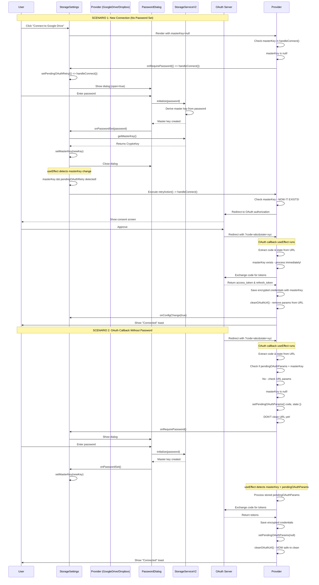

# Storage Connection & Encryption Flow

## Overview
This document explains the complete flow for connecting to cloud storage providers with end-to-end encryption.

## The Critical Bugs That Were Fixed

### Bug #1: Initial Connection Without Password
**The Problem:**
- User clicked "Connect to Google Drive" without setting password first
- App showed password dialog
- After password was set, OAuth flow never started
- User had to click "Connect" again

**The Fix:**
- When `handleConnect()` detects no masterKey, it now passes a retry action to `onRequirePassword`
- The retry action is `() => handleConnect()` which restarts the connection after password is set
- `StorageSettings` uses a `useEffect` to watch for masterKey changes and automatically calls the retry action

### Bug #2: OAuth Callback Race Condition  
**The Problem:**
- OAuth redirected back with `?code=...` in URL
- App immediately cleaned the URL (removed code/state) at line 72
- Then checked if masterKey exists at line 90
- If no masterKey, showed password dialog
- But OAuth code was already removed from URL!
- When masterKey became available, there was nothing left to process

**The Fix:**
- App now stores OAuth params (`{ code, state }`) in component state before cleaning URL
- If masterKey is missing, params are stored in `pendingOAuthParams` state
- Password dialog is shown
- When masterKey becomes available, `useEffect` detects `pendingOAuthParams` and processes them
- Only AFTER successful processing is the URL cleaned

## Complete Flow Diagram



## Key Components

### 1. StorageSettings.tsx
**Responsibilities:**
- Manages master key state
- Shows password dialog when needed
- Tracks pending OAuth retry actions
- Uses `useEffect` to trigger retry when masterKey becomes available

**Critical State:**
```typescript
const [masterKey, setMasterKey] = useState<CryptoKey | null>(storageServiceV2.getMasterKey());
const [pendingOAuthRetry, setPendingOAuthRetry] = useState<(() => void) | null>(null);
const [pendingConnection, setPendingConnection] = useState<string | null>(null);
```

**The Retry Mechanism:**
```typescript
useEffect(() => {
  if (masterKey && pendingOAuthRetry) {
    const retryAction = pendingOAuthRetry;
    setPendingConnection(null);
    setPendingOAuthRetry(null);
    console.log('🔑 Master key ready, triggering OAuth');
    retryAction(); // Calls handleConnect() in the provider
  }
}, [masterKey, pendingOAuthRetry, pendingConnection]);
```

### 2. GoogleDriveSync.tsx / DropboxSync.tsx
**Responsibilities:**
- Handle OAuth flow (authorization & token exchange)
- Store OAuth params if masterKey not available
- Process stored params when masterKey becomes available

**Critical State:**
```typescript
const [pendingOAuthParams, setPendingOAuthParams] = useState<{ code: string; state: string } | null>(null);
```

**The OAuth Callback Handler:**
```typescript
useEffect(() => {
  const handleOAuthRedirect = async () => {
    // FIRST: Check if we have pending params to process
    if (pendingOAuthParams && masterKey) {
      await exchangeCodeForTokens(pendingOAuthParams.code, pendingOAuthParams.state);
      setPendingOAuthParams(null);
      cleanOAuthUrl();
      return;
    }

    // THEN: Check URL for new OAuth callback
    const code = params.get('code');
    const state = params.get('state');
    
    if (code && state) {
      if (!masterKey) {
        // Store params, don't clean URL yet
        setPendingOAuthParams({ code, state });
        onRequirePassword(() => { /* retry handled by StorageSettings */ });
        return;
      }
      
      // Process immediately if masterKey available
      await exchangeCodeForTokens(code, state);
      cleanOAuthUrl();
    }
  };

  handleOAuthRedirect();
}, [masterKey, pendingOAuthParams]); // Watch BOTH
```

### 3. StorageServiceV2.ts
**Responsibilities:**
- Initialize encryption with password
- Derive master key from password + salt
- Store master key in memory
- Handle re-initialization correctly

**Key Method:**
```typescript
async initialize(password: string): Promise<void> {
  // If already initialized with master key, just return
  if (this.isInitialized && this.masterKey) {
    return;
  }
  
  // If initialized but missing key, re-derive it
  if (this.isInitialized && !this.masterKey && password) {
    const storedSalt = await getFromIndexedDB('settings', 'localKeySalt');
    if (storedSalt) {
      const salt = new Uint8Array(base64ToArrayBuffer(storedSalt.value));
      this.masterKey = await deriveKeyFromPassword(password, salt);
      return;
    }
  }
  
  // First time initialization
  await openDB();
  
  // Load or generate salt
  let salt = await loadStoredSalt();
  if (!salt) {
    salt = generateSalt();
    await storeSalt(salt);
  }
  
  // Derive master key
  this.masterKey = await deriveKeyFromPassword(password, salt);
  this.isInitialized = true;
}
```

## Why This Architecture Works

1. **Single Source of Truth**: `StorageServiceV2` owns the master key
2. **React State Propagation**: `StorageSettings` mirrors the key in React state
3. **Automatic Retry**: `useEffect` watches for state changes and triggers actions
4. **No Race Conditions**: OAuth params are stored before URL is cleaned
5. **Idempotent Operations**: Re-initialization is safe and won't break existing connections

## Testing the Flow

### Test Case 1: Connect Without Password
1. Open app (no password set)
2. Click "Connect to Google Drive"
3. Password dialog should appear
4. Enter password
5. Dialog closes
6. **Immediately** redirects to Google OAuth (no second click needed!)
7. Approve on Google
8. Redirects back
9. Shows "Connected to Google Drive" toast

### Test Case 2: OAuth Callback Without Password
1. Open app (no password set)
2. Manually navigate to OAuth callback URL: `http://localhost:8080/?code=abc123&state=xyz789`
3. Password dialog should appear
4. Enter password
5. Dialog closes
6. **Immediately** processes the OAuth code (no manual retry!)
7. Shows "Connected" toast

### Test Case 3: Multiple Providers
1. Set password once
2. Connect to Google Drive ✓
3. Connect to Dropbox ✓  
4. Connect to Nextcloud ✓
5. All should work without asking for password again

## Common Mistakes to Avoid

❌ **Don't clean OAuth URL before checking masterKey**
```typescript
// WRONG
cleanOAuthUrl(); // Removes params
if (!masterKey) { ... } // Too late!
```

✅ **Store params first, clean later**
```typescript
// RIGHT
if (!masterKey) {
  setPendingOAuthParams({ code, state }); // Store first
  // Don't clean URL yet
  return;
}
await processOAuth(code, state); // Process
cleanOAuthUrl(); // Clean after success
```

❌ **Don't pass empty retry action**
```typescript
// WRONG
onRequirePassword(() => {
  // Nothing here - OAuth won't retry!
});
```

✅ **Pass actual retry action**
```typescript
// RIGHT
onRequirePassword(() => handleConnect());
```

❌ **Don't forget useEffect dependencies**
```typescript
// WRONG - Won't trigger when masterKey changes
useEffect(() => {
  if (masterKey && pendingOAuthRetry) {
    pendingOAuthRetry();
  }
}, []); // Missing dependencies!
```

✅ **Include all reactive values**
```typescript
// RIGHT
useEffect(() => {
  if (masterKey && pendingOAuthRetry) {
    pendingOAuthRetry();
  }
}, [masterKey, pendingOAuthRetry]);
```

## Debugging Tips

Enable these console logs to trace the flow:

```typescript
// In StorageSettings
console.log('🔒 Requesting password for:', providerName);
console.log('🔑 Master key set:', !!newMasterKey);
console.log('🔑 Master key ready, triggering OAuth for', provider);

// In Provider (GoogleDrive/Dropbox)
console.log('🔒 Master key not available, requesting password before OAuth');
console.log('🔒 OAuth callback received but master key not available - storing params');
console.log('🔑 Processing pending OAuth params now that master key is available');
```

Watch for this sequence in console:
1. `🔒 Master key not available, requesting password`
2. `🔑 Master key set: true`
3. `🔑 Master key ready, triggering OAuth for Google Drive`
4. *(redirect to Google)*
5. `🔑 Processing pending OAuth params...` OR processes immediately
6. Toast: "Connected to Google Drive"
