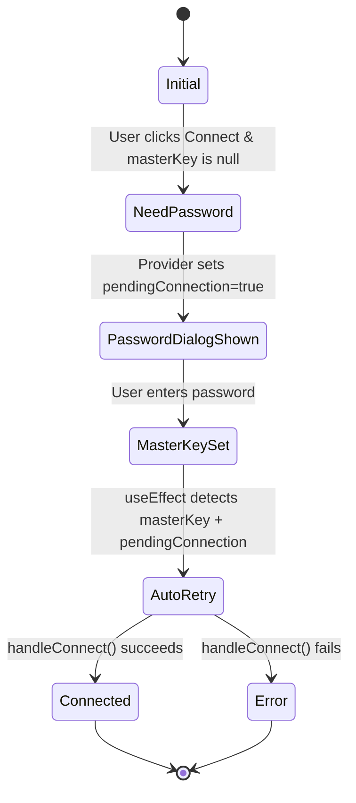
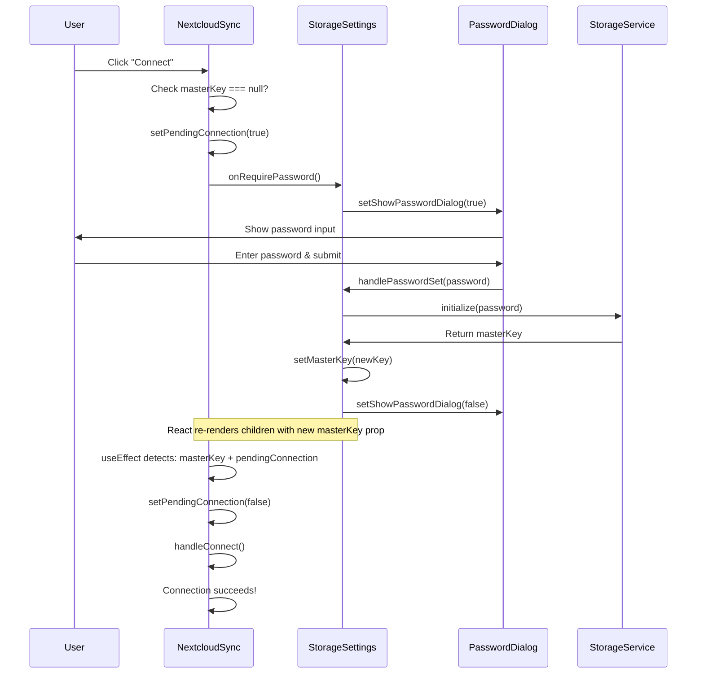

# Storage Connection State Machine - Fixed Architecture

## Problem Summary

The previous implementation had a **callback-based retry mechanism** that fought against React's declarative nature, causing:
- Race conditions between state updates and callback execution
- Infinite loops of password requests
- Unreliable setTimeout delays to "hope" React had updated
- The `masterKey` prop not updating in child components before retry callbacks executed

## New Architecture: Pure React State Flow

### Core Principle
**No callbacks, no race conditions - just React state watching**

Each storage provider component (NextcloudSync, GoogleDriveSync, etc.) manages its own connection state and watches for `masterKey` prop changes.



## Implementation

### NextcloudSync.tsx

```typescript
interface NextcloudSyncProps {
  masterKey: CryptoKey | null;
  onRequirePassword?: () => void;  // No callback parameter!
  onConfigChange?: (config: NextcloudConfig | null) => void;
}

export const NextcloudSync = ({ masterKey, onRequirePassword }: NextcloudSyncProps) => {
  const [pendingConnection, setPendingConnection] = useState(false);
  
  // Auto-retry when masterKey becomes available
  useEffect(() => {
    if (masterKey && pendingConnection && !isConnecting) {
      console.log('✅ Master key now available, auto-retrying connection');
      setPendingConnection(false);
      handleConnect();  // Retry connection automatically
    }
  }, [masterKey, pendingConnection, isConnecting]);
  
  const handleConnect = async () => {
    if (!masterKey) {
      console.log('🔐 No master key, requesting password');
      setPendingConnection(true);  // Mark that we need to retry
      onRequirePassword?.();        // Just show the dialog
      return;
    }
    
    // Proceed with connection logic...
  };
};
```

### StorageSettings.tsx

```typescript
export const StorageSettings = () => {
  const [masterKey, setMasterKey] = useState<CryptoKey | null>(null);
  const [showPasswordDialog, setShowPasswordDialog] = useState(false);
  
  const handleRequirePassword = () => {
    console.log('🔐 Password required, showing dialog');
    setShowPasswordDialog(true);
  };
  
  const handlePasswordSet = async (password: string) => {
    await storageServiceV2.initialize(password);
    const newMasterKey = storageServiceV2.getMasterKey();
    
    setMasterKey(newMasterKey);  // This triggers useEffect in child components
    setShowPasswordDialog(false);
    
    // That's it! No manual retry triggering needed.
    // Child components watch for masterKey changes and auto-retry.
  };
  
  return (
    <>
      <JournalPasswordDialog
        open={showPasswordDialog}
        onPasswordSet={handlePasswordSet}
      />
      
      <NextcloudSync
        masterKey={masterKey}
        onRequirePassword={handleRequirePassword}
      />
    </>
  );
};
```

## Flow Diagram



## Key Improvements

### Before (Broken)
- ❌ Callback-based retry mechanism
- ❌ Race condition: callback executes before React updates child props
- ❌ Infinite loops of password requests
- ❌ Unreliable setTimeout delays
- ❌ Complex state management with refs

### After (Fixed)
- ✅ Pure React state flow
- ✅ No race conditions - useEffect waits for React to update
- ✅ Single source of truth for masterKey
- ✅ Each component manages its own pending state
- ✅ No callbacks, no timeouts, no refs
- ✅ Predictable and testable

## Testing Checklist

1. ✅ Click Connect without password → Password dialog appears
2. ✅ Enter password → Dialog closes immediately
3. ✅ Connection automatically retries after password set
4. ✅ Connection succeeds without showing password dialog again
5. ✅ No infinite loops of password requests
6. ✅ No dark/unclickable dialogs

## Best Practices

1. **Single Responsibility**: Each component manages one thing
   - NextcloudSync: Manages connection state and retries
   - StorageSettings: Manages password dialog and master key
   
2. **Declarative State**: Let React handle the timing
   - Don't use callbacks to trigger retries
   - Don't use setTimeout to wait for state updates
   - Use useEffect to watch for state changes
   
3. **Clear State Machine**: Each component has a clear state flow
   - Initial → NeedPassword → PasswordSet → AutoRetry → Connected

## Common Mistakes to Avoid

❌ **DON'T** call retry actions directly in password set handler
❌ **DON'T** use setTimeout to wait for React state updates
❌ **DON'T** pass callback functions as retry mechanisms
❌ **DON'T** use refs to work around async state updates

✅ **DO** use useEffect to watch for state changes
✅ **DO** let React handle the timing of re-renders
✅ **DO** use local component state for pending actions
✅ **DO** keep state machines simple and predictable
